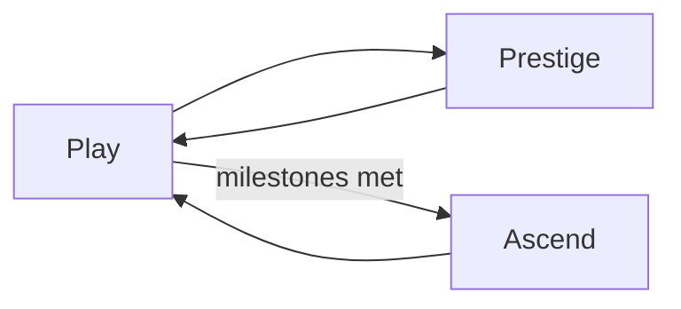

# AFK AI — Generic Idle Progressive Game Framework
## Agent Implementation Prompt (v1.1)

> **Status:** Complete implementation prompt (v1.1 — `file://` delivery, classic scripts, dual-source layout). Build the full framework (phases 0–10).

---

## 0. Invocation

You are implementing a **themeable idle / incremental game** using the **AFK AI Idle Progressive Game Framework**.

### Theme input (replace placeholders)

| Variable | Example | Your value |
|----------|---------|------------|
| `THEME_NAME` | Cosmic Time Factory | ___ |
| `PRIMARY_RESOURCE.codeName` | timeShards | ___ |
| `PRIMARY_RESOURCE.displayName` | Time Shards | ___ |
| `PRIMARY_RESOURCE.icon` | ⏱️ | ___ |
| `TONE` | sci-fi, cosmic, mysterious | ___ |
| `COLOR_PALETTE` | indigo / violet / amber accents | ___ |
| `FONT_PRIMARY` | Inter | ___ |
| `FONT_DISPLAY` | optional display font | ___ |

All display names, icons, flavor text, and config content must reflect `THEME_NAME`. Logic IDs (`codeName`) must be camelCase English, theme-agnostic where possible.

### Hard constraints (non-negotiable)

1. **Vue 3 only** for UI — no React, no Svelte, no Angular.
2. **Zero npm/webpack/Vite to run** — the playable game requires no Node install. Opening `index.html` in a browser must work. A **Python bundle script** (no npm) regenerates shipped artifacts from source + config; running it is part of development, not a player requirement.
3. **`file://` is the primary delivery mode** — the game **must** run by opening `index.html` directly (`file://`). HTTP static server is optional convenience only, not required for verification or ship.
4. **No runtime ES modules for local code** — no `type="module"` and no cross-file `import`/`export` in shipped scripts. Browsers block module loads on `file://`.
5. **No `fetch()` for config at runtime** — config is embedded in a classic script (`js/config-bundle.js` → `window.AFK_CONFIG`). Source of truth remains editable `config/*.json`; the bundle script regenerates `config-bundle.js`.
6. **Vue via global build only** — `vue.global.prod.js` (classic `<script>` → `window.Vue`). **Forbidden:** ESM Vue build + import map for local bootstrap.
7. **Classic script load order** — all local playable scripts are `<script src="...">` without `type="module"`, in dependency order (see bootstrap below).
8. **CDN for third-party assets** — Vue, animate.css, fonts load from CDN in `index.html`. Pin exact versions.
9. **No business logic in UI** — Vue components render state and dispatch actions; they do not contain formulas or economy rules.
10. **No math outside FormulaEngine** — all numeric game calculations go through the engine API.
11. **Config-driven — no magic numbers** — every tunable value lives in `config/*.json` (embedded via bundle). JS logic only; numeric literals forbidden except `0`, `1`, `-1`.

### CDN + `file://` bootstrap (required pattern)

Replace import map / ES module bootstrap with **classic scripts only**:

```html
<!DOCTYPE html>
<html lang="en">
<head>
  <meta charset="UTF-8">
  <meta name="viewport" content="width=device-width, initial-scale=1.0">
  <title>{{THEME_NAME}}</title>
  <link rel="preconnect" href="https://fonts.googleapis.com">
  <link rel="preconnect" href="https://fonts.gstatic.com" crossorigin>
  <link href="https://fonts.googleapis.com/css2?family={{FONT_PRIMARY}}:wght@400;500;600;700&display=swap" rel="stylesheet">
  <link rel="stylesheet" href="https://cdnjs.cloudflare.com/ajax/libs/animate.css/4.1.1/animate.min.css">
  <link rel="stylesheet" href="css/styles.css">
</head>
<body>
  <div id="app"></div>
  <!-- Vue global build — NOT vue.esm-browser -->
  <script src="https://unpkg.com/vue@3.4.21/dist/vue.global.prod.js"></script>
  <!-- Playable artifacts (regenerated by scripts/bundle-for-file-protocol.py) -->
  <script src="js/config-bundle.js"></script>
  <script src="js/afk-engine.bundle.js"></script>
  <script src="js/afk-ui.bundle.js"></script>
  <script src="js/main.js"></script>
</body>
</html>
```

**No `type="module"` on any local script.** `index.html` stays under **80 lines** — bootstrap only.

`js/main.js` bootstrap (classic script):

```javascript
(function () {
  var Vue = window.Vue;
  var AFK = window.AFK;
  var AFK_UI = window.AFK_UI;
  AFK.init({ config: window.AFK_CONFIG });
  Vue.createApp(AFK_UI.App).mount('#app');
})();
```

**Forbidden:** import maps, `type="module"` local scripts, `fetch('config/...')` at runtime, inline 2000-line `index.html`.

### Dual-source layout (source vs shipped)

| Layer | Path | Role |
|-------|------|------|
| **Editable source** | `js/core/*`, `js/game/*`, `js/ui/*` | Authoring source of truth (may use `export` internally; bundled away) |
| **Editable config** | `config/*.json` | Authoring source of truth |
| **Shipped / playable** | `js/config-bundle.js`, `js/afk-engine.bundle.js`, `js/afk-ui.bundle.js`, `js/main.js` | What `index.html` loads on `file://` |
| **Bundle tool** | `scripts/bundle-for-file-protocol.py` | Regenerates shipped artifacts when source or config changes |

**Agent workflow:** after any edit to `config/*.json`, engine source, or UI source → run `python scripts/bundle-for-file-protocol.py` → verify by opening `index.html` via **`file://`** (not only HTTP).

### Global namespace & script scope (mandatory)

Bundled classic scripts **must not** leak top-level `function` / `class` / `const` names to `window` (causes redeclaration errors when scripts reload or order shifts — especially in Firefox).

- Wrap engine, UI, and bootstrap bodies in **IIFEs**.
- Expose **only** these globals:

| Global | Contents |
|--------|----------|
| `window.AFK_CONFIG` | All config JSON (from `config-bundle.js`) |
| `window.AFK` | Engine API: `init`, `loadAllConfigs`, `GameState`, `GameLoop`, `FormulaEngine`, `EventBus`, etc. |
| `window.AFK_UI` | Vue component registry + `App` root component |

**Bootstrap rule:** call `AFK.init(...)`, `AFK.GameState.performTap()`, etc. — **never** destructure globals:

```javascript
// FORBIDDEN — can throw or collide
const { loadAllConfigs } = window.AFK;

// CORRECT
window.AFK.loadAllConfigs(window.AFK_CONFIG);
```

`ConfigManager` reads from `window.AFK_CONFIG` (or argument passed to `AFK.init`) — **never** `fetch()`.

### Vue component pattern (source → bundle)

Author UI in `js/ui/*.vue.js` source files. The bundle script concatenates/wraps them into `afk-ui.bundle.js` assigning to `window.AFK_UI`.

Source shape (pre-bundle):

```javascript
// js/ui/ResourceBar.vue.js — bundled into AFK_UI
(function (exports) {
  exports.ResourceBar = {
    name: 'ResourceBar',
    props: { resources: Object, primaryCurrencyRate: Number },
    template: '<div class="resource-bar">...</div>'
  };
})(window.AFK_UI_PARTS = window.AFK_UI_PARTS || {});
```

Final bundle exposes: `window.AFK_UI = { App, ResourceBar, GeneratorPanel, ... }`.

Components use `window.Vue` APIs (`createApp`, `reactive`, `computed`) via closure or `AFK_UI` factory — no ESM `import` in shipped output.

**Forbidden:** `.vue` SFCs, `@/` aliases, JSX/TSX, runtime `import`/`export` in playable scripts.

---

## 1. Core design principles

### Separation of concerns

| Layer | Responsibility | Allowed to mutate GameState? |
|-------|----------------|------------------------------|
| `/config/*.json` | Static definitions | No |
| `/js/core/*` | Infrastructure (load, save, events) | No |
| `/js/game/*` | Rules, formulas, tick logic | Yes (via GameState methods) |
| `/js/ui/*` | Presentation, input | No (dispatch actions only) |

### Object standardization

Every game entity in config must have:

- `codeName` — unique string ID used in logic and save data (**never shown to player**)
- `displayName` — player-facing label (may be themed)
- `description` — tooltip / panel copy
- `icon` — emoji or short unicode symbol (CDN icon fonts optional later)

### Single source of truth

- **ConfigManager** (via `window.AFK`) — reads `AFK_CONFIG`; exposes `isFeatureUnlocked`, `getEffectiveDifficulty`, `getResourceDisplayName`, `formatResourceCost`, `formatUnlockCondition`, `validateGeneratorChain`
- **GameState** — authoritative mutable runtime state
- **FormulaEngine** — stateless calculations reading GameState + ConfigManager
- **ModifierSystem** — collects and orders modifiers; FormulaEngine applies them

### Communication

Systems communicate via **EventBus** for side effects (achievements, notifications, analytics). State mutations happen in GameState methods; events notify listeners after mutation.

### Determinism

Given identical config + saved state + elapsed offline seconds, all calculations must produce identical results. Required for save/load integrity and offline simulation.

### No magic numbers (mandatory)

| Allowed in JS | Must come from config |
|---------------|----------------------|
| Control flow (`if`, loops) | Tick rate, max delta, FPS target |
| Object keys, event names | Drop rates, cost multipliers, primary currency production bases |
| `0`, `1`, `-1` in arithmetic | Save intervals, offline cap, stagnation hint delay |
| Import paths, module wiring | Difficulty scaling per ascension tier |
| | Character stats, active limits, prestige formulas |
| | Number format thresholds (K/M/B/T) |
| | Purchase multiplier options |
| | CDN URLs (in `index.html` only) |

**Lint rule for agents:** if a numeric literal appears in `/js/game/*` or `/js/core/*`, it must be justified as `0`, `1`, or `-1` or moved to config.

All code reads tunables via `ConfigManager.getFramework()`, `getGenerator()`, etc. — never hardcoded fallbacks like `|| 1.15`.

---

## 2. File structure (contract)

```
/
├── index.html                      # classic script bootstrap only (<80 lines)
├── css/styles.css
├── config/                         # EDITABLE config source (not loaded at runtime)
│   ├── framework.json
│   ├── difficulty.json
│   ├── resources.json
│   ├── generators.json
│   ├── upgrades.json
│   ├── items.json
│   ├── artifacts.json
│   ├── characters.json
│   ├── achievements.json
│   ├── events.json
│   ├── drops.json
│   ├── ascension.json
│   └── prestige.json
├── scripts/
│   └── bundle-for-file-protocol.py # regenerates js/*-bundle.js from config + source
├── js/
│   ├── config-bundle.js            # SHIPPED — window.AFK_CONFIG (generated)
│   ├── afk-engine.bundle.js        # SHIPPED — window.AFK (generated)
│   ├── afk-ui.bundle.js            # SHIPPED — window.AFK_UI (generated)
│   ├── main.js                     # SHIPPED — bootstrap IIFE (hand-written, classic)
│   ├── core/                       # SOURCE — ConfigManager, EventBus, SaveManager, ProgressTracker
│   ├── game/                       # SOURCE — GameState, GameLoop, FormulaEngine, systems/*
│   └── ui/                         # SOURCE — *.vue.js components
```

---

## 3. Implementation phases (strict order)

Implement in this order. Update **ProgressTracker** after each phase. Do not skip ahead.

| Phase | Deliverable | ProgressTracker section |
|-------|-------------|-------------------------|
| **0** | `index.html` classic bootstrap, bundle script stub, empty `AFK`/`AFK_UI`, ProgressTracker | `scaffold` |
| **1** | `config-bundle.js` generation; ConfigManager reads `AFK_CONFIG`; **generator chain validation (hard fail)** | `config` |
| **2** | EventBus, GameState shell, SaveManager stub | `core` |
| **3** | FormulaEngine + ModifierSystem with unit-testable pure functions | `formula` |
| **4** | Resources, Generators, `performTap()`, ActionBar + dual TapButtons, GameLoop tick | `gameplay-core` |
| **5** | Upgrades, bulk purchase (1/10/100/MAX) | `upgrades` |
| **6** | Save/load, offline progress, save versioning + migration | `save` |
| **7** | Characters, Items, Inventory, equipment modifiers | `characters` |
| **8** | Drops, Artifacts (separate from consumables) | `loot` |
| **9** | PrestigeSystem + AscensionSystem, milestone tracking, feature unlocks, Achievements, Events | `meta` |
| **10** | ActionBar, SettingsPanel, UI polish; **final bundle + `file://` verification** | `polish` |

After **every phase** that touches config, engine, or UI source: run `python scripts/bundle-for-file-protocol.py`.

**Stop rule:** Do not claim the task complete until ProgressTracker shows 100% for all sections in scope.

**Delivery target:** **Full** implementation (phases 0–10 in one pass).

---

## 4. Unified unlock conditions (SYS-UNLOCK)

One condition schema used by **generators**, **upgrades**, **ascension gates**, and **feature visibility**.

```json
{
  "operator": "AND",
  "conditions": [
    { "type": "achievement", "achievement": "firstGenerator" },
    { "type": "canAffordFirstPurchase", "generator": "cosmicSailor" },
    { "type": "resourceHeld", "resource": "cosmicEnergy", "amount": 10 }
  ]
}
```

### Condition types (complete list)

| type | Scope | Fields | Used for |
|------|-------|--------|----------|
| `achievement` | lifetime | `achievement` | Generator/upgrade/ascension gates |
| `canAffordFirstPurchase` | snapshot | `generator` | Generator unlock |
| `generatorOwned` | snapshot | `generator`, `quantity` | Generator/upgrade gates |
| `resourceHeld` | snapshot | `resource`, `amount` | Generator unlock (current balance) |
| `upgradePurchased` | snapshot | `upgrade`, `level?` | Generator gates |
| `ascensionTier` | meta | `minTier` | High-tier content |
| `prestigeCount` | **current ascension tier only** | `min` | Generator gates, ascension gates |
| `lifetimeResourcesGenerated` | **lifetime, never decreases** | `resource`, `min` | Ascension gates |
| `lifetimeGeneratorPurchases` | **lifetime, sum all generators** | `min` | Ascension gates |
| `lifetimePrestiges` | lifetime | `min` | Optional ascension gates |

`FormulaEngine.evaluateUnlockConditions(conditions, state, config)` returns `{ met: boolean, unmet: Condition[] }`.

**Naming rule:** use `unlockConditions` everywhere. Do **not** use legacy `unlockRequirement` in new config.

### Milestone tracking (mandatory hooks)

| Event | Updates |
|-------|---------|
| Resource gain | `resources[r].totalEarned` and `meta.milestones.lifetimeResourcesGenerated[r]` |
| Generator purchase | `meta.milestones.lifetimeGeneratorPurchases` (+1 per unit bought) |
| Prestige performed | `meta.ascension.tiers[currentTier].prestigeCount`, `meta.milestones.lifetimePrestiges` |
| Ascension performed | `currentTier++`, reset `prestigeCount` for **new** tier to 0, increment `timesAscendedTo` |

Lifetime milestone counters **never decrease**.

---

## 5. Progress Tracker (SYS-00)

Dev/debug tab only — not visible in production builds (toggle via `?debug=1` URL param or `settings.devMode`).

### Tracks

- [ ] Each `/js/` module exists and exports expected API
- [ ] `scripts/bundle-for-file-protocol.py` runs without error
- [ ] `window.AFK_CONFIG` populated; no runtime `fetch` for config
- [ ] Generator chain validation passes with **zero errors** (hard fail on mismatch)
- [ ] Game opens from **`file://`** with no CORS/module console errors
- [ ] Each UI panel mounts without Vue warnings
- [ ] Each EventBus event has ≥1 emitter and is documented

### UI

- Vertical sidebar tab: 🔧 Progress (dev only; respects `sidebarPosition`)
- Checklist grouped by phase
- Green ✓ / red ✗ per item
- Overall completion percentage

- [ ] Ascension milestone gates reference valid condition types
- [ ] Generator production chain validates — **blocks ship** if generator N missing gate output for N+1
- [ ] Every `unlockedFeatures` entry in `ascension.json` resolves to a real config entity

---

## 6. Framework config (SYS-FRAMEWORK)

`config/framework.json` holds every engine constant. **No defaults in code.**

```json
{
  "gameLoop": {
    "tickRate": 10,
    "maxDeltaCapSeconds": 1,
    "targetFps": 60
  },
  "save": {
    "storageKey": "afk_ai_save",
    "autoSaveIntervalMs": 10000,
    "rollingBackupIntervalMs": 300000,
    "maxBackups": 5,
    "offlineCapSeconds": 7200,
    "offlineModalMinSeconds": 60
  },
  "ui": {
    "maxContentWidthPx": 640,
    "resourceBarTopCount": 4,
    "stagnationHintSeconds": 60,
    "purchaseMultipliers": [1, 10, 100, "MAX"],
    "sidebarDefaultPosition": "right",
    "actionBarHeightPx": 64,
    "tapAction": {
      "percentOfPrimaryCurrencyProduction": 0.10,
      "minGain": 1,
      "cooldownMs": 0
    },
    "actionBar": {
      "maxSkillSlots": 4,
      "maxBoostSlots": 4
    }
  },
  "numberFormat": {
    "thresholds": [
      { "suffix": "K", "value": 1000 },
      { "suffix": "M", "value": 1000000 },
      { "suffix": "B", "value": 1000000000 },
      { "suffix": "T", "value": 1000000000000 }
    ],
    "displayPrecision": 2
  },
  "characters": {
    "maxActive": 3
  },
  "devTools": {
    "speedMultipliers": [1, 2, 5, 10]
  }
}
```

`config/difficulty.json` — **cumulative, one-way** scaling per ascension tier (never decreases):

```json
{
  "profiles": {
    "tier0": { "costMultiplier": 1.0, "primaryCurrencyMultiplier": 1.0, "offlineEfficiency": 1.0 },
    "tier1": { "costMultiplier": 1.15, "primaryCurrencyMultiplier": 0.98, "offlineEfficiency": 0.95 },
    "tier2": { "costMultiplier": 1.30, "primaryCurrencyMultiplier": 0.95, "offlineEfficiency": 0.90 },
    "tier3": { "costMultiplier": 1.50, "primaryCurrencyMultiplier": 0.90, "offlineEfficiency": 0.85 }
  },
  "stacking": "multiplicative",
  "prestigeDifficultyPerCount": {
    "costIncreasePerPrestige": 0.02,
    "primaryCurrencyDecreasePerPrestige": 0.01
  }
}
```

`FormulaEngine.getEffectiveDifficulty(state, config)` multiplies profiles from `tier0` through `tier{currentTier}` and optional prestige-count modifiers. **Ascension never reduces difficulty.**

---

## 7. Technical requirements (SYS-TECH)

### Script loading & global namespace (SYS-SCRIPT)

- **`file://` is mandatory** for final verification; HTTP server is optional.
- All shipped local scripts: classic `<script src>` only — **no** `type="module"`.
- Bundles wrapped in IIFEs; expose only `window.AFK_CONFIG`, `window.AFK`, `window.AFK_UI`.
- No top-level `function` / `class` / `const` leaks to `window` (test refresh in **Firefox** — no redeclaration errors).
- Bootstrap calls `AFK.init(...)`, `AFK.GameState.performTap()` — **never** `const { x } = window.AFK`.
- **No runtime `fetch()`** for config JSON.
- After source/config edits: run `python scripts/bundle-for-file-protocol.py`.

### Bundle script (`scripts/bundle-for-file-protocol.py`)

Must:

1. Read all `config/*.json` → emit `js/config-bundle.js` as `window.AFK_CONFIG = { ... }`.
2. Concatenate/wrap `js/core/*`, `js/game/*`, `js/systems/*` → `js/afk-engine.bundle.js` → `window.AFK`.
3. Concatenate/wrap `js/ui/*` → `js/afk-ui.bundle.js` → `window.AFK_UI`.
4. Run generator chain validation; **exit non-zero** on any chain error (see §14).
5. Be runnable with stdlib Python 3 only (no pip dependencies required).

### Layout

- Mobile-first, max content width **640px**, centered
- No horizontal scrolling at 375px viewport
- Fixed **top** resource bar (persistent)
- Fixed **bottom** action bar (persistent) — skills, boosts, dual tap buttons
- Vertical tab bar on **right by default** (icons + optional labels); user may move to **left** via Settings
- Single active content panel between top bar and bottom action bar
- Content area `padding-bottom` ≥ `framework.ui.actionBarHeightPx` so nothing hides behind action bar

### Game loop

All values from `config/framework.json` → `gameLoop`:

- **Logic tick:** `tickRate` updates/second (fixed timestep, accumulator pattern)
- **Render:** `requestAnimationFrame`, target `targetFps`
- **Max delta cap:** `maxDeltaCapSeconds` per frame (prevent spiral of death)
- Offline simulation runs on load before loop starts

### Performance

- Cache modifier totals; invalidate on purchase, equip, prestige, ascension, event start/end
- Batch resource updates per tick
- No `JSON.stringify` on every tick

---

## 8. UI / UX design (SYS-UI)

### Layout regions (default: tabs on right)

```
┌──────────────────────────────────────────┐
│  Resource Bar (fixed top)                │
├──────────────────────────────┬─────────┤
│                              │   Tab   │
│   Active Panel Content       │   Tab   │
│                              │   Tab   │
│                              │   ...   │
├──────────────────────────────┴─────────┤
│ [TAP]  skill  boost  ...  boost  [TAP] │  ← Action Bar (fixed bottom)
└──────────────────────────────────────────┘
```

When `settings.sidebarPosition === "left"`, mirror horizontally: tabs on left, content on right. Action bar unchanged.

CSS: apply class `sidebar-right` (default) or `sidebar-left` on `.app-container`. Transition smoothly when toggling (config: `framework.ui.sidebarTransitionMs` optional).

### Tabs (minimum)

| Tab ID | Icon | Panel |
|--------|------|-------|
| generators | ⚙️ | GeneratorPanel |
| upgrades | ⬆️ | UpgradePanel |
| characters | 👤 | CharacterPanel |
| inventory | 🎒 | InventoryPanel |
| achievements | 🏆 | AchievementPanel |
| ascension | 🔄 | AscensionPanel |
| stats | 📊 | StatsPanel |
| settings | 🛠️ | SettingsPanel |
| progress | 🔧 | ProgressPanel (dev only) |

### Settings panel (SYS-SETTINGS)

Persist in `state.settings` (included in save payload):

| Setting | Type | Default | Source |
|---------|------|---------|--------|
| `sidebarPosition` | `"left"` \| `"right"` | `"right"` | `framework.ui.sidebarDefaultPosition` |
| `soundEnabled` | boolean | true | user |
| `notificationsEnabled` | boolean | true | user |
| `showTutorial` | boolean | true | user |
| `devMode` | boolean | false | URL `?debug=1` overrides |

**Settings UI must include:** sidebar position toggle (Left / Right) with live preview. Changing position re-layouts immediately without reload.

### Fixed bottom action bar (SYS-ACTIONBAR)

Component: `ActionBar.vue.js` — always visible, fixed to viewport bottom, `z-index` above content, below modals.

#### Layout (left → right)

```
[ TAP primary ] | [ active skill slots ... ] | [ active boost slots ... ] | [ TAP primary ]
```

- **Tap buttons (required):** two identical `TapButton` instances — **far left** and **far right**. Both call `GameState.performTap()`. Same gain, same cooldown, same animation.
- **Center scroll region:** horizontal scroll if overflow; hosts clickable skill and boost slots.

#### Tap action (primary resource)

Manual tap generates primary currency equal to a **percentage of total generator primary currency production per second**:

```
primaryCurrencyFromGenerators = FormulaEngine.calculatePrimaryCurrencyRate(state, config, mods, primaryResourceCode)
baseGain = primaryCurrencyFromGenerators × framework.ui.tapAction.percentOfPrimaryCurrencyProduction
gain = FormulaEngine.applyModifierStack(baseGain, clickModifiers).value
gain = max(gain, framework.ui.tapAction.minGain)
```

- Does **not** use legacy flat `clickYield` alone — tap is tied to generator output. Upgrades/artifacts that boost primary currency production or click power affect tap gain.
- Optional cooldown: `framework.ui.tapAction.cooldownMs` (0 = spam allowed).
- Emit `TAP_PERFORMED` and `CLICK_PERFORMED` (alias for achievement tracking).
- UI: show projected gain on button label or tooltip; `animate__pulse` on tap.

Implement `FormulaEngine.calculateTapGain(state, config, mods)` — all numbers from config.

#### Active skill slots

Display **activated character skills** the player can trigger manually:

- Source: characters with `activeSkill` defined in `config/characters.json`
- State: `{ cooldownRemaining, charges?, isReady }` per skill
- Slot shows icon, cooldown overlay, disabled when on cooldown
- Click → `GameState.activateSkill(codeName)` — applies configured effect via ModifierSystem / EventBus
- Empty slots hidden or shown as locked placeholders if feature not unlocked

#### Active boost slots

Display **clickable temporary boosts** currently available to the player:

- Source (priority order):
  1. Consumable items in inventory marked `"actionBarEligible": true` in `items.json`
  2. Active timed buffs with manual re-trigger (if config allows)
  3. Random event grants that add action-bar buttons (optional)
- Slot shows icon, quantity (for consumables), duration bar if active
- Click → `GameState.useBoost(codeName)` — consumes item or activates buff per config
- When buff is running, slot shows remaining duration (from `state.activeBuffs`)

#### Action bar rules

- Slots populated reactively from GameState — no static hardcoded buttons except dual TapButton
- Max visible slots from `framework.ui.actionBar.maxSkillSlots` / `maxBoostSlots` in config
- Bar height from `framework.ui.actionBarHeightPx`
- Safe-area inset for notched phones: `padding-bottom: env(safe-area-inset-bottom)`

### Purchase multipliers & buy buttons (generators + upgrades)

Global control (persist selection in GameState):

- Options from `config/framework.json` → `ui.purchaseMultipliers` (default: **1 / 10 / 100 / MAX**)
- Highlight active multiplier
- MAX = largest affordable quantity for current resource balance

**Buy button disabled when ANY of:**

1. Entity **not unlocked** (`unlockConditions` unmet)
2. **Bulk quantity is 0** (including MAX resolving to 0)
3. Player **cannot afford** total bulk cost for selected multiplier

**Buy button label:**

- Quantity 1: `Buy` or `Buy · {formatted cost}`
- Quantity > 1: **`Buy ×{qty}`** (e.g. `Buy ×10`) plus cost if space allows
- Disabled state: visually muted + `cursor: not-allowed`; tooltip explains why (locked / cannot afford / MAX=0)

**Upgrades:** same rules — show upgrade row when visible; **disable** (do not hide) when unaffordable. Never remove the row solely because the player lacks funds.

Applies to **GeneratorPanel** and **UpgradePanel**.

### Feedback (use animate.css classes)

| Action | Feedback |
|--------|----------|
| Tap primary | `animate__pulse` on TapButton + `+N` float over resource bar |
| Purchase | Resource bar delta flash, brief `-N` / `+N` float |
| Skill / boost used | Slot cooldown animation + toast if configured |
| Unlock | Card border pulse + toast notification |
| Achievement | Toast + `animate__bounceIn` on badge |
| Primary currency rate change | Stats panel breakdown refresh |
| Prestige / Ascension | Full-screen confirm modal listing **exactly** what is lost vs kept |

### Player-facing names (mandatory — SYS-DISPLAY)

`codeName` is **logic-only**. The player must **never** see raw `codeName` strings in UI, toasts, modals, or tooltips.

**Required helper** (on `ConfigManager` / `AFK` API):

```javascript
AFK.getResourceDisplayName('timeShards')   // → "Time Shards"
AFK.getGeneratorDisplayName('cosmicSailor') // → "Cosmic Sailor"
AFK.formatResourceCost({ timeShards: 10, cosmicEnergy: 5 })
// → "10 Time Shards · 5 Cosmic Energy"
AFK.formatUnlockCondition(condition) // → "Hold 25 Stardust" not "Hold 25 stardust"
```

Use `displayName` (and `icon`) from `resources.json`, `generators.json`, `achievements.json`, etc.

**Applies to:** resource bar, costs, unlock condition lists, milestone progress, offline modal, prestige/ascension LOST/KEPT lists, toasts, action bar tooltips.

**Examples:**

| Wrong | Correct |
|-------|---------|
| Hold 25 stardust | Hold 25 Stardust |
| Need achievement firstGenerator | Need achievement: First Generator |
| +100 timeShards | +100 Time Shards ⏱️ |

---

### Tooltips

- Tap/click to open; tap outside to close
- Optional long-press 500ms on touch devices
- Show: description, current effect, next level effect — all using **displayName**, never codeName

### Smart hints (Full scope)

- Highlight most efficient upgrade (lowest cost per primary currency gain)
- Detect stagnation (config: `framework.ui.stagnationHintSeconds`) while affordable option exists → subtle hint toast

### `App.vue.js` structure (required)

```javascript
// Layout order in template:
// 1. ResourceBar (fixed top)
// 2. .main-layout — flex row
//    a. TabSidebar (v-if left) OR content + TabSidebar (v-if right, default)
//    b. .content-area — active panel; padding-bottom for action bar
// 3. ActionBar (fixed bottom) — always mounted
// Modals / toasts as siblings
```

`TabSidebar` reads `state.settings.sidebarPosition`. `ActionBar` is **outside** the scrollable content area.

Tabs, generators, and panels may declare `requiredFeature` (string code). Hidden or shown locked until `ConfigManager.isFeatureUnlocked()` passes for current ascension tier.

### Default settings state (in GameState)

```javascript
settings: {
  sidebarPosition: 'right',  // initialized from framework.ui.sidebarDefaultPosition
  soundEnabled: true,
  notificationsEnabled: true,
  showTutorial: true,
  devMode: false
}
```

---

## 9. Core gameplay loop (SYS-LOOP)

1. **Tap** (ActionBar) → primary currency = `%` of generator primary currency production × click modifiers
2. **Generators** → passive production per tick; each generator feeds gate resources for the next
3. **Spend** on generators / upgrades when `unlockConditions` met
4. **Prestige** (repeatable) → soft reset within current ascension tier; earn prestige currency; increment tier `prestigeCount`
5. **Ascend** (one-way, when milestones met) → permanent difficulty ↑, unlock new features, minimal reset, `prestigeCount` resets for new tier
6. **Repeat** at higher difficulty with newly unlocked systems



### Progression feel

| Phase | Player experience |
|-------|---------------------|
| Early | Rapid gains, frequent unlocks |
| Mid | Synergy between generators and upgrades |
| Late | Diminishing returns softened by prestige shop bonuses and artifacts |

---

## 10. Economy model (SYS-ECON)

### Growth curves

Support configurable curve types per generator/upgrade:

- `linear` — base × quantity
- `exponential` — base × multiplier^quantity (default for costs)
- `logarithmic` — used for prestige gain formulas

### Inflation controls

- Soft caps (configurable per generator)
- Hard caps (absolute max owned)
- Diminishing returns on stacked multipliers (see ModifierSystem)

---

## 11. Formula Engine (SYS-FORMULA) — required standalone module

All numeric operations go through `FormulaEngine.js`. Other modules call it; they do not reimplement formulas.

### Required functions

```javascript
formatNumber(value, precision?)
calculateTapGain(state, config, mods)       // % of generator primary currency production; used by ActionBar
calculateClickGain(state, config, mods)   // alias or legacy; prefer calculateTapGain
calculateGeneratorCost(gen, owned, mods)  // returns { resourceCode: cost }
calculateBulkCost(gen, owned, qty, mods)    // sum of next qty purchases
calculateMaxAffordable(gen, owned, balances, mods)
calculatePrimaryCurrencyRate(state, config, mods, resourceCode?)
calculatePrimaryCurrencyBreakdown(...)    // per-generator contribution + %
calculateOfflineGains(elapsedSec, state, config, mods, capSec)
calculatePrestigeGain(state, config)          // uses run-scoped stats + config formula
getEffectiveDifficulty(state, config)         // cumulative ascension + optional prestige scaling
evaluateUnlockConditions(conditions, state, config)
applyModifierStack(base, modifiers)
```

All formula coefficients (`costMultiplier` defaults, log bases, etc.) come from entity config or `framework.json` / `difficulty.json` — never inline.

### Number formatting rules

- Use float internally; display with formatting only
- Thresholds from `config/framework.json` → `numberFormat.thresholds`
- Display precision from `numberFormat.displayPrecision`
- Store full precision in state; never round stored quantities on tick

### Generator cost formula

```
cost(resource) = floor(baseCost × costResourceMultiplier × costMultiplier^owned × costReductionMods)
```

Where `costMultiplier^owned` uses the generator's `costMultiplier` from config.

---

## 12. Modifier System (SYS-MODIFIER) — required standalone module

### Modifier sources

| Source | Examples |
|--------|----------|
| Upgrades | globalMultiplier, clickMultiplier, categoryMultiplier |
| Characters | activated character stat bonuses |
| Equipment | weapon/armor/accessory/artifact slots |
| Prestige shop | purchased permanent bonuses from `prestige.json` |
| Artifacts | permanent collection bonuses |
| Events | temporary timed boosts |
| Items | consumable buffs (duration-based) |

### Modifier shape

```javascript
{
  codeName: string,
  target: 'global' | 'click' | 'resource' | 'generator' | 'category' | 'cost',
  targetId?: string,          // generator codeName or category codeName
  type: 'additive' | 'multiplicative',
  value: number,
  priority: number,           // lower = applied earlier within tier
  expiresAt?: number          // ms timestamp; omit for permanent
}
```

### Stacking order (mandatory)

1. Start with **base value**
2. Sum all **additive** modifiers for that target
3. Multiply by product of **multiplicative** modifiers, ordered by tier:
   - **Local** (specific generator)
   - **Category**
   - **Global**
   - **Prestige**
   - **Temporary** (events, buffs)
4. Apply **min/max caps** from config if defined
5. Apply **diminishing returns** if configured (optional per modifier)

`ModifierSystem.collect(state, config)` returns ordered list.  
`FormulaEngine.applyModifierStack(base, modifiers)` returns `{ value, breakdown[] }`.

---

## 13. Resources (SYS-RES)

### Config schema (`config/resources.json`)

```json
{
  "resources": [
    {
      "codeName": "timeShards",
      "displayName": "Time Shards",
      "description": "Primary currency",
      "icon": "⏱️",
      "color": "#6366f1",
      "isPrimary": true,
      "baseValue": 0
    }
  ]
}
```

### Runtime state (per resource)

```javascript
{
  quantity: number,
  totalEarned: number,
  totalSpent: number
}
```

### Rules

- Exactly one resource must have `"isPrimary": true` (tap target + default display)
- Primary currency tap gain from generator production percentage (§8 ActionBar)
- **UI shows `displayName` + icon only** — never `codeName` (see SYS-DISPLAY)
- Primary currency rate computed by FormulaEngine, not stored as authoritative (cache ok)
- On every gain: increment `totalEarned` and `meta.milestones.lifetimeResourcesGenerated[codeName]`

- Resource bar shows primary currency + top N by production rate (N from `framework.ui.resourceBarTopCount`)

---

## 14. Generators (SYS-GEN)

### Unlock rules (CONFIRMED)

Generator **purchase availability** requires **all** conditions in `unlockConditions` (see §4). Default operator: **AND**.

Supported types for generators: `achievement`, `canAffordFirstPurchase`, `generatorOwned`, `resourceHeld`, `upgradePurchased`, `ascensionTier`, `prestigeCount`.

First generator: `"unlockConditions": null`.

**UI for locked generators:** list every unmet condition with **display names** and progress (e.g. "Achievement: First Steps ✓", "Hold 50 Cosmic Energy: 32/50").

### Resource production chain (CONFIRMED)

Each generator must produce the resources needed to progress to the **next** generator:

1. **Generator 1** produces: **primary resource** + **gate resource(s)** for generator 2's unlock/purchase.
2. **Generator N** produces: gate resource(s) for generator N+1 (may also produce prior resources at reduced rate).
3. Config documents the chain explicitly via `produces[].role`:

| role | Meaning |
|------|---------|
| `primary` | Main currency (usually only generator 1 + clicks) |
| `unlockGate` | Resource required to unlock/afford the next generator |
| `bonus` | Optional extra output |

```json
{
  "generators": [
    {
      "codeName": "timeWarden",
      "unlockConditions": null,
      "produces": [
        { "resource": "timeShards", "amount": 1, "role": "primary" },
        { "resource": "cosmicEnergy", "amount": 0.5, "role": "unlockGate", "forGenerator": "cosmicSailor" }
      ],
      "costResources": [{ "resource": "timeShards", "multiplier": 1 }],
      "baseCost": 10,
      "costMultiplier": 1.15
    },
    {
      "codeName": "cosmicSailor",
      "unlockConditions": {
        "operator": "AND",
        "conditions": [
          { "type": "achievement", "achievement": "firstGenerator" },
          { "type": "canAffordFirstPurchase" },
          { "type": "resourceHeld", "resource": "cosmicEnergy", "amount": 10 }
        ]
      },
      "produces": [
        { "resource": "cosmicEnergy", "amount": 1, "role": "unlockGate", "forGenerator": "starForge" },
        { "resource": "stardust", "amount": 0.5, "role": "unlockGate", "forGenerator": "starForge" }
      ],
      "costResources": [
        { "resource": "timeShards", "multiplier": 1 },
        { "resource": "cosmicEnergy", "multiplier": 1 }
      ]
    }
  ]
}
```

**Validation rule (hard fail — blocks ship):** For each generator except the last, `produces` must include **every resource** referenced in the **next** generator's:

- `costResources[].resource`
- `unlockConditions` of type `resourceHeld`

Run at bundle time and in ProgressTracker. **On failure:** emit explicit error (generator codeName + missing resource), **exit non-zero**, do not ship. No `console.warn`-only path.

Implement `AFK.validateGeneratorChain(config)` returning `{ valid, errors[] }`.

#### Late-chain example (generators 8–10 — seed must match)

```json
{
  "codeName": "temporalEngine",
  "displayName": "Temporal Engine",
  "produces": [
    { "resource": "chrononParticles", "amount": 2, "role": "unlockGate", "forGenerator": "cosmicFoundry" }
  ]
},
{
  "codeName": "cosmicFoundry",
  "displayName": "Cosmic Foundry",
  "unlockConditions": {
    "operator": "AND",
    "conditions": [
      { "type": "resourceHeld", "resource": "chrononParticles", "amount": 50 },
      { "type": "canAffordFirstPurchase" }
    ]
  },
  "costResources": [
    { "resource": "chrononParticles", "multiplier": 1 },
    { "resource": "timeShards", "multiplier": 0.5 }
  ],
  "produces": [
    { "resource": "singularityDust", "amount": 1, "role": "unlockGate", "forGenerator": "infinityChronometer" }
  ]
},
{
  "codeName": "infinityChronometer",
  "displayName": "Infinity Chronometer",
  "unlockConditions": {
    "operator": "AND",
    "conditions": [
      { "type": "resourceHeld", "resource": "singularityDust", "amount": 25 }
    ]
  },
  "costResources": [{ "resource": "singularityDust", "multiplier": 1 }]
}
```

`temporalEngine` must produce `chrononParticles` (cosmicFoundry gate). `cosmicFoundry` must produce `singularityDust` (infinityChronometer gate). Full 10-generator seed must pass `validateGeneratorChain` with zero errors.

### Config schema (summary)

See examples above. Every numeric field (`baseCost`, `costMultiplier`, `produces[].amount`) lives in JSON — never duplicated in JS.

### Runtime state (per generator)

```javascript
{
  quantityPurchased: number,
  totalSpent: number,
  totalEarned: number,
  isUnlocked: boolean       // true once unlockConditions first pass; persists through prestige and ascension (Option A)
}
```

### UI

- Card per generator, grouped by category (collapsible)
- Show: icon, **displayName**, owned count, primary currency contribution, next cost (formatted with display names), buy button per §8
- Locked generators: list **all unmet conditions** from `unlockConditions`
- Show production roles: which gate resources this generator feeds forward
- Efficiency indicator: `% of total primary currency production` from breakdown

### Default generator chain

Ship **10 generators** with full production chain validation, achievement-gated unlocks, and escalating costs — all defined in `generators.json` + linked entries in `achievements.json`.

---

## 15. Upgrades (SYS-UPG)

### Effect types (enum)

```
globalMultiplier | clickMultiplier | resourceMultiplier |
generatorMultiplier | categoryMultiplier | costReduction |
unlock | flatResourceBonus
```

### Config example

```json
{
  "upgrades": [
    {
      "codeName": "clickMultiplier",
      "displayName": "Click Power",
      "category": "global",
      "icon": "👆",
      "cost": 50,
      "costResource": "timeShards",
      "effect": { "type": "clickMultiplier", "multiplier": 3 },
      "unlockConditions": null,
      "maxLevel": 5
    }
  ]
}
```

### Rules

- One-time vs repeatable controlled by `maxLevel` (null = unlimited; legacy `maxPurchases` still supported)
- Cost scaling for repeatable: `cost × costScale^purchaseCount` (both values in upgrade config)
- Upgrades may also use `unlockConditions` (same schema as generators)
- Purchasing recalculates modifiers and checks achievement/unlock conditions
- **Buy button:** same disabled/label rules as §8 (not unlocked, qty 0, unaffordable); disabled not hidden

---

## 16. Characters & Inventory (SYS-CHAR / SYS-INV)

### Characters

- Config defines base stats, unlock requirements, max active count, optional `activeSkill` for action bar
- `activeSkill` schema in `characters.json`:

```json
{
  "activeSkill": {
    "codeName": "temporalBurst",
    "displayName": "Temporal Burst",
    "icon": "⚡",
    "cooldownSeconds": 30,
    "effect": { "type": "globalMultiplier", "multiplier": 2, "durationSeconds": 10 }
  }
}
```

- State: `{ unlocked, activated, level, experience, equipment: {...}, skillCooldownRemaining }`
- Active limit from `config/framework.json` → `characters.maxActive`

### Items

Types: `equipable | consumable | ingredient`

Consumables may set `"actionBarEligible": true` to appear in the bottom action bar when owned.

### Inventory

- State: `{ [itemCodeName]: quantity }`
- Equip/unequip updates ModifierSystem
- Consumables apply temporary modifiers with `expiresAt`

- Characters tab gated by ascension feature unlock (e.g. `"tab:characters"` at tier 1)

---

## 17. Drops & Artifacts (SYS-DROP / SYS-ART)

All drop rates and weights in `config/drops.json` — no literals in `DropSystem.js`.

### Drops (`config/drops.json`)

```json
{
  "dropTables": [
    {
      "codeName": "passiveTick",
      "trigger": "tick",
      "chancePerSecond": 0.10,
      "entries": [
        { "item": "energyCell", "weight": 80, "quantity": [1, 1] },
        { "item": "rareCrystal", "weight": 20, "quantity": [1, 1] }
      ]
    },
    {
      "codeName": "onClick",
      "trigger": "click",
      "chance": 0.02,
      "entries": [...]
    }
  ]
}
```

### Artifacts (`config/artifacts.json`)

Separate from consumable items. Permanent collection once acquired.

```json
{
  "artifacts": [
    {
      "codeName": "chronoLens",
      "displayName": "Chrono Lens",
      "description": "All generators +10% primary currency production",
      "icon": "🔮",
      "rarity": "rare",
      "effect": { "type": "globalMultiplier", "multiplier": 1.10 }
    }
  ]
}
```

State: `{ acquired: { [codeName]: { acquiredAt } } }`

### Artifact persistence (CONFIRMED)

| Action | Artifacts |
|--------|-----------|
| **Prestige** | **Kept** — never removed |
| **Ascension** (all tiers) | **Kept** — never removed |
| **Full game wipe** | Cleared (new game only) |

Artifacts are permanent collection bonuses. No ascension tier clears artifacts.

---

## 18. Prestige & Ascension (SYS-PRESTIGE / SYS-ASCENSION)

Prestige and Ascension are **distinct, documented actions**. All rules in `config/prestige.json` and `config/ascension.json`. Implemented in `PrestigeSystem.js` and `AscensionSystem.js`.

### Terminology

| Term | Meaning | Reversible? |
|------|---------|-------------|
| **Prestige** | Soft reset **within** current ascension tier. Earns prestige currency. | Yes — repeatable |
| **Ascension** | One-way promotion to next meta tier. Permanent difficulty ↑ + feature unlocks. | **No** |
| **Ascension tier** | Current meta layer (`0` = base / Mortal, up to `3`). | Only increases |
| **Milestone** | Lifetime or tier-scoped stat gating ascension | Never decreases |

### Mental model

- **Prestige** = run loop: grow → reset → spend shards → grow faster (same ascension tier).
- **Ascension** = chapter advance: meet milestones → harder forever → new tabs/generators/systems unlock.
- Difficulty from ascension **stacks multiplicatively** and **never reverts**.

### State shape

```javascript
meta: {
  ascension: {
    currentTier: 0,                 // 0 = starting tier; max defined in ascension.json (default 3)
    tiers: {
      0: { prestigeCount: 0, timesAscendedTo: 1 },  // tier 0 entered at new game
      1: { prestigeCount: 0, timesAscendedTo: 0 },
      2: { prestigeCount: 0, timesAscendedTo: 0 },
      3: { prestigeCount: 0, timesAscendedTo: 0 }
    },
    totalAscensions: 0            // lifetime ascensions performed
  },
  milestones: {
    lifetimeResourcesGenerated: { /* resource codeName → number */ },
    lifetimeGeneratorPurchases: 0,
    lifetimePrestiges: 0
  },
  prestige: {
    currency: 0,
    lifetimeCurrencyEarned: 0,
    purchasedBonuses: { /* codeName → level */ },
    run: {
      resourcesEarnedThisRun: { /* reset each prestige */ },
      peakPrimaryCurrencyThisRun: 0
    }
  }
}
```

**Counter rules:**

| Counter | Increments when | Resets when |
|---------|-----------------|-------------|
| `tiers[n].prestigeCount` | Prestige at tier `n` | Ascension to tier `n+1` (new tier starts at 0) |
| `tiers[n].timesAscendedTo` | First arrival at tier `n` | Never |
| `lifetimeResourcesGenerated` | Any resource gain | Never |
| `lifetimeGeneratorPurchases` | Any generator buy (+qty) | Never |
| `lifetimePrestiges` | Any prestige | Never |
| `prestige.run.*` | During current run | Each prestige |

---

### Prestige (soft reset)

#### Availability

Minimum requirements in `config/prestige.json` → `prestigeMinimum` (e.g. run resource value, primary resource held). Evaluated by `FormulaEngine.evaluateUnlockConditions`.

#### On prestige — apply `onPrestige` profile (CONFIRMED — uniform across ascension tiers)

| Cleared | Kept |
|---------|------|
| All resource **balances** | Artifacts |
| All generator **quantities** (`quantityPurchased → 0`) | Generator **`isUnlocked` flags** |
| Repeatable upgrade purchase counts | Achievements |
| Temporary buffs / active events | Ascension tier |
| Consumable inventory (if `clearInventory: true` in config) | Prestige shop purchases (`purchasedBonuses`) |
| `prestige.run` stats | Characters unlocked |
| | Lifetime milestone counters |
| | Lifetime ascension/prestige stat counters |

**Artifacts never cleared on prestige.**

#### Prestige grants

- Prestige currency from `prestige.json` → `gainFormula` using `prestige.run` stats
- Increment `tiers[currentTier].prestigeCount` and `milestones.lifetimePrestiges`
- Optional starting seed from config (`startingResourcesAfterPrestige`)

---

### Ascension (one-way meta promotion)

#### Availability

All conditions in next tier's `ascensionRequirements` must pass (**AND**). Default gate includes all three milestone types:

1. `prestigeCount` — min prestiges **in current ascension tier**
2. `lifetimeResourcesGenerated` — min lifetime total for named resource(s)
3. `lifetimeGeneratorPurchases` — min sum of all generator purchases ever

Optional additional conditions: `achievement`, `lifetimePrestiges`.

#### On ascension — apply `onAscend` profile (CONFIRMED — Option A minimal reset)

| Cleared | Kept |
|---------|------|
| All resource **balances** | Artifacts |
| All generator **quantities** | Generator **`isUnlocked` flags** |
| | Upgrade purchase counts (`purchasedBonuses` from prestige shop) |
| | Achievements |
| | Characters / inventory |
| | Lifetime milestone counters |
| | Meta stat counters (`timesAscendedTo`, lifetime totals) |

Then:

1. `currentTier++` (cannot exceed max tier in config)
2. `tiers[newTier].prestigeCount = 0`
3. `tiers[newTier].timesAscendedTo++`
4. `totalAscensions++`
5. Apply cumulative difficulty profile for new tier
6. Activate `unlockedFeatures` for new tier → emit `FEATURE_UNLOCKED` per feature

**Ascension cannot be undone. No downgrade path.**

#### Feature unlocks (`unlockedFeatures`)

String codes in `ascension.json` per tier. Examples:

| Code pattern | Effect |
|--------------|--------|
| `tab:characters` | Show characters tab |
| `tab:artifacts` | Show artifacts section |
| `generators:starForge` | Activate generator in UI + production |
| `resources:quantumFlux` | Show resource in bar |
| `systems:drops` | Enable drop tables |
| `systems:randomEvents` | Enable event system |
| `prestigeShop:tier2` | Unlock prestige shop tier |

`ConfigManager.isFeatureUnlocked(code, state)` checks cumulative features from tier `0..currentTier`.

Config entities for locked features may exist in JSON but are **inactive** until feature unlock (no production, no UI, no drops).

---

### Difficulty scaling

From `config/difficulty.json`:

```
effectiveCostMultiplier = product(profiles[0..currentTier].costMultiplier) × prestigeScaling(prestigeCount)
```

Applied in `FormulaEngine.getEffectiveDifficulty`. **Never decreases** when ascending — only steps up at each tier.

---

### Config — `config/prestige.json`

```json
{
  "prestigeCurrency": {
    "codeName": "prestigeShards",
    "displayName": "Prestige Shards",
    "gainFormula": "floor(log10(max(1, runResourceValue / minimum)))",
    "minimumResourceValue": 1000,
    "resourceWeights": { "timeShards": 1, "cosmicEnergy": 0.5 }
  },
  "prestigeMinimum": {
    "operator": "AND",
    "conditions": [
      { "type": "resourceHeld", "resource": "timeShards", "amount": 1000 }
    ]
  },
  "onPrestige": {
    "clearCurrency": true,
    "clearGeneratorQuantities": true,
    "keepGeneratorUnlocks": true,
    "clearUpgrades": true,
    "clearInventory": false,
    "clearArtifacts": false,
    "clearTemporaryBuffs": true,
    "resetRunStats": true
  },
  "prestigeBonuses": [
    {
      "codeName": "globalBoost",
      "displayName": "Cosmic Resonance",
      "cost": 1,
      "maxLevel": 25,
      "effect": { "type": "globalMultiplier", "multiplierPerLevel": 0.05 }
    }
  ]
}
```

---

### Config — `config/ascension.json`

```json
{
  "maxTier": 3,
  "ascensionTiers": [
    {
      "tier": 0,
      "codeName": "mortal",
      "displayName": "Mortal Realm",
      "isStartingTier": true,
      "difficultyProfile": "tier0",
      "unlockedFeatures": ["tab:generators", "tab:upgrades", "tab:achievements", "tab:stats", "tab:settings"]
    },
    {
      "tier": 1,
      "codeName": "awakened",
      "displayName": "Awakened Realm",
      "difficultyProfile": "tier1",
      "ascensionRequirements": {
        "operator": "AND",
        "conditions": [
          { "type": "prestigeCount", "min": 3 },
          { "type": "lifetimeResourcesGenerated", "resource": "timeShards", "min": 1000000 },
          { "type": "lifetimeGeneratorPurchases", "min": 100 }
        ]
      },
      "onAscend": {
        "clearCurrency": true,
        "clearGeneratorQuantities": true,
        "keepGeneratorUnlocks": true,
        "clearUpgrades": false,
        "clearInventory": false,
        "clearArtifacts": false
      },
      "unlockedFeatures": [
        "tab:characters",
        "tab:inventory",
        "systems:drops",
        "generators:quantumProcessor",
        "resources:quantumFlux"
      ]
    },
    {
      "tier": 2,
      "codeName": "transcendent",
      "displayName": "Transcendent Realm",
      "difficultyProfile": "tier2",
      "ascensionRequirements": {
        "operator": "AND",
        "conditions": [
          { "type": "prestigeCount", "min": 5 },
          { "type": "lifetimeResourcesGenerated", "resource": "timeShards", "min": 1000000000 },
          { "type": "lifetimeGeneratorPurchases", "min": 500 }
        ]
      },
      "onAscend": {
        "clearCurrency": true,
        "clearGeneratorQuantities": true,
        "keepGeneratorUnlocks": true,
        "clearUpgrades": false,
        "clearInventory": false,
        "clearArtifacts": false
      },
      "unlockedFeatures": ["tab:artifacts", "systems:randomEvents", "prestigeShop:tier2"]
    },
    {
      "tier": 3,
      "codeName": "cosmic",
      "displayName": "Cosmic Realm",
      "difficultyProfile": "tier3",
      "ascensionRequirements": {
        "operator": "AND",
        "conditions": [
          { "type": "prestigeCount", "min": 10 },
          { "type": "lifetimeResourcesGenerated", "resource": "timeShards", "min": 1000000000000 },
          { "type": "lifetimeGeneratorPurchases", "min": 2000 }
        ]
      },
      "onAscend": {
        "clearCurrency": true,
        "clearGeneratorQuantities": true,
        "keepGeneratorUnlocks": true,
        "clearUpgrades": false,
        "clearInventory": false,
        "clearArtifacts": false
      },
      "unlockedFeatures": ["systems:allGenerators", "tab:ascension"]
    }
  ]
}
```

All tiers use **Option A** minimal ascension reset unless config overrides. **No tier clears artifacts.**

---

### UI — AscensionPanel

**Section A — Prestige**

- Ascension tier badge + effective difficulty summary
- `Prestiges this tier: {prestigeCount}` | `Lifetime: {lifetimePrestiges}`
- Projected shard gain (from run stats)
- **LOST / KEPT** columns from `onPrestige`
- **Prestige** button (disabled if below `prestigeMinimum`)

**Section B — Ascension**

- Next tier name, difficulty delta (+X% costs), feature preview list
- Milestone checklist with progress bars (all three required types + optional achievements)
- **LOST / KEPT** columns from `onAscend`
- **Ascend** button (disabled until all met; modal: *"This cannot be undone."*)
- Hidden when `currentTier >= maxTier`

**Stats strip:** `Ascension {tier} · Prestige {count} (this tier) · Lifetime purchases: {n} · Lifetime {resource}: {formatted}`

---

## 19. Achievements (SYS-ACH)

### Requirement types

```
totalTaps | totalClicks | resourceEarned | generatorOwned | generatorCount |
primaryCurrencyReached | prestigeCount | ascensionCount | artifactCount | itemCollected | playTime
```

Achievements can **gate generator unlocks** via `unlockConditions`. Define milestone achievements early in the chain.

### Rewards

```
resourceBonus | modifierUnlock | titleUnlock | unlockGenerator
```

Toast + animate.css on unlock. Permanent record in state. Achievements **always kept** on prestige and ascension (never cleared by reset profiles).

---

## 20. Events (SYS-EVENT)

Random timed events from `config/events.json`.

```json
{
  "events": [
    {
      "codeName": "solarFlare",
      "displayName": "Solar Flare",
      "description": "All stellar generators ×2 for 30s",
      "icon": "☀️",
      "duration": 30,
      "minInterval": 120,
      "maxInterval": 300,
      "effect": { "type": "categoryMultiplier", "category": "stellar", "multiplier": 2 }
    }
  ]
}
```

UI: timed popup banner; active effects listed in stats panel. Events system gated by `systems:randomEvents` feature unlock.

---

## 21. Save system (SYS-SAVE)

All intervals and keys from `config/framework.json` → `save`.

### Storage

- `localStorage` key from `framework.save.storageKey`
- Auto-save interval: `framework.save.autoSaveIntervalMs`
- Rolling backup: `framework.save.rollingBackupIntervalMs` (keep `framework.save.maxBackups`)

### Save payload

```javascript
{
  version: "1.0.0",
  timestamp: number,
  state: { /* GameState serializable subset */ },
  checksum: string  // optional simple hash for corruption detection
}
```

### Offline progress

- On load: `elapsed = now - lastTimestamp`
- Apply `calculateOfflineGains(min(elapsed, framework.save.offlineCapSeconds))`
- Show offline gains modal if elapsed > `framework.save.offlineModalMinSeconds`

### Migration

- `SaveManager.migrate(data)` chain: v1.0.0 → v1.1.0 → …
- Never delete unknown keys silently; log and preserve in `_legacy` bag

### Export / import

- Export: download JSON file
- Import: file picker + confirm overwrite

---

## 22. EventBus catalog

| Event | Emitted when |
|-------|--------------|
| `GAME_TICK` | Each logic tick |
| `GAME_LOADED` | Save loaded or new game started |
| `GAME_SAVED` | Save written |
| `GAME_RESET` | Full reset |
| `RESOURCE_CHANGED` | Any resource quantity change |
| `RESOURCE_GAINED` | Positive delta |
| `RESOURCE_SPENT` | Negative delta |
| `CLICK_PERFORMED` | Player tap on primary resource (ActionBar TapButton) |
| `TAP_PERFORMED` | Same as CLICK_PERFORMED (explicit tap event) |
| `SKILL_ACTIVATED` | Character active skill triggered from action bar |
| `BOOST_USED` | Consumable or boost activated from action bar |
| `GENERATOR_PURCHASED` | Generator bought |
| `UPGRADE_PURCHASED` | Upgrade bought |
| `CHARACTER_ACTIVATED` | Character toggled on |
| `ITEM_ACQUIRED` | Item added to inventory |
| `ITEM_EQUIPPED` | Equipment changed |
| `ITEM_DROPPED` | Loot drop |
| `ARTIFACT_ACQUIRED` | New artifact |
| `ACHIEVEMENT_UNLOCKED` | Achievement earned |
| `RANDOM_EVENT_START` | Event begins |
| `RANDOM_EVENT_END` | Event expires |
| `PRESTIGE_PERFORMED` | Soft reset complete; run stats cleared |
| `ASCENSION_PERFORMED` | Ascension tier advanced (one-way) |
| `MILESTONE_PROGRESS` | Ascension milestone threshold crossed (optional UI toast) |
| `FEATURE_UNLOCKED` | New tab/generator/system activated |
| `OFFLINE_PROGRESS` | Offline gains applied |
| `NOTIFICATION_SHOWN` | Toast displayed |

---

## 23. Dev tools (SYS-DEV)

Available when `?debug=1` or dev tab enabled:

- Add/remove resources
- Set game speed from `framework.devTools.speedMultipliers`
- Force ascension milestone / set prestige count (debug only)
- Force drop / force event
- Export state snapshot to console
- Formula breakdown inspector (last click, last primary currency rate calc)

---

## 24. Theming (CSS variables)

Define in `css/styles.css`:

```css
:root {
  --color-bg: #0f0f1a;
  --color-bg-panel: #1a1a2e;
  --color-primary: #6366f1;
  --color-accent: #f59e0b;
  --color-text: #e2e8f0;
  --color-muted: #64748b;
  --font-primary: 'Inter', sans-serif;
  --action-bar-height: 64px;
  --sidebar-width: 56px;
}
```

Theme input replaces values; components use variables only — no hardcoded theme colors in JS.

---

## 25. Validation checklist (agent self-test)

Before reporting complete, verify:

### Functional

- [ ] Tap gain = `percentOfPrimaryCurrencyProduction` × generator primary currency rate × click modifiers
- [ ] Both TapButtons (left + right) trigger identical `performTap()` with same gain
- [ ] Action bar shows active skills and eligible boosts; clicks dispatch to GameState
- [ ] Settings sidebar toggle moves tabs left/right; persists in save
- [ ] Generators produce correct primary currency per resource
- [ ] Bulk buy 10/100/MAX charges correct total
- [ ] Generator unlock requires **all** `unlockConditions` (achievements + afford + etc.)
- [ ] Each generator produces gate resources for the next generator in chain
- [ ] Prestige applies `onPrestige` profile; keeps artifacts and generator unlocks
- [ ] Ascension requires all milestone conditions (prestigeCount + lifetimeResourcesGenerated + lifetimeGeneratorPurchases)
- [ ] Ascension is one-way; difficulty never decreases
- [ ] Ascension resets `prestigeCount` for new tier only; lifetime milestones never decrease
- [ ] Artifacts never cleared on prestige or ascension
- [ ] `ConfigManager.isFeatureUnlocked` gates tabs/generators/systems correctly
- [ ] Per-tier `prestigeCount` and `timesAscendedTo` tracked independently
- [ ] Offline gains capped and applied once on load
- [ ] Save → refresh → identical primary currency rate and resources
- [ ] Save migration runs without data loss
- [ ] **No magic numbers in JS** — grep `/js` for numeric literals other than 0/1/-1

### UX

- [ ] Content not obscured by fixed top resource bar or bottom action bar at 375px
- [ ] Sidebar right by default; settings can move to left
- [ ] All tabs navigable; locked tabs show unmet unlock conditions
- [ ] animate.css feedback on purchase and unlock
- [ ] AscensionPanel shows separate Prestige vs Ascension LOST/KEPT lists
- [ ] AscensionPanel milestone progress bars update live
- [ ] ProgressTracker 100%

### Technical

- [ ] Opens and plays from **`file://`** with no console CORS/module errors
- [ ] No global redeclaration errors in **Firefox** on refresh
- [ ] Generator chain validation passes with **zero warnings/errors** (bundle exits 0)
- [ ] Buy buttons **disabled** when purchase impossible (locked / qty 0 / unaffordable)
- [ ] Buy label shows **`Buy ×{qty}`** when bulk quantity > 1
- [ ] **No raw `codeName`** visible in any player-facing UI
- [ ] Only globals exposed: `AFK_CONFIG`, `AFK`, `AFK_UI`, `Vue` (CDN)
- [ ] No runtime `fetch()` for config; no local `type="module"`
- [ ] Vue loaded from **`vue.global.prod.js`** (not ESM build)
- [ ] `python scripts/bundle-for-file-protocol.py` succeeds after final edit
- [ ] index.html < 80 lines, no inlined game logic
- [ ] All formulas traceable to FormulaEngine via `AFK` API
- [ ] `prestige.json` and `ascension.json` embedded in `AFK_CONFIG`

---

## 26. Default seed content

If theme input is empty, use **Cosmic Time Factory** with:

- 10 generators in validated production chain + achievement-gated `unlockConditions`
- 4 ascension tiers (0–3) in `ascension.json` with milestone gates using all three required types
- Linked `prestige.json` shop bonuses and `difficulty.json` profiles
- Drop rates in `drops.json`: `chancePerSecond: 0.10`, click `chance: 0.02`
- Late-chain generators include **Temporal Engine → Cosmic Foundry → Infinity Chronometer** (see §14)
- Run bundle script; verify **`file://`** before ship

Replace all copy when theme is provided.

---

# Decision log (v1.1)

## Resolved decisions

| ID | Topic | Decision |
|----|-------|----------|
| DEL-01 | Primary delivery | **`file://`** — open `index.html` directly; HTTP optional |
| DEL-02 | Runtime modules | **No** local ES modules; classic scripts only |
| DEL-03 | Config load | **`window.AFK_CONFIG`** via `config-bundle.js`; no runtime `fetch` |
| DEL-04 | Vue load | **`vue.global.prod.js`** → `window.Vue` |
| DEL-05 | Globals | Only `AFK_CONFIG`, `AFK`, `AFK_UI`; IIFE-wrapped bundles |
| DEL-06 | Bundle script | `scripts/bundle-for-file-protocol.py` (stdlib Python) |
| DEL-07 | Generator chain | **Hard fail** at bundle time if chain invalid |
| DEL-08 | Buy UX | Disabled when locked / qty 0 / unaffordable; `Buy ×N` label |
| DEL-09 | Display names | **Never show codeName** to player; use `AFK.format*` helpers |
| OPEN-01 | Tick rate | **10/sec** |
| OPEN-05 | Delivery scope | **Full** (phases 0–10) |
| UI-01–03 | Layout / tap | Right sidebar default; action bar; tap % of primary currency production |
| TER-01 | Terminology | **No PPS** — use **primary currency** / **primary currency rate** / **primary currency production** |
| ASC / GEN / CFG | See v0.3 | Milestone ascension, unlock chain, no magic numbers |

## Implementation authority

This prompt supersedes `samples/IdleGameFramework.md` and all prior drafts.

---

*End of prompt v1.1*
